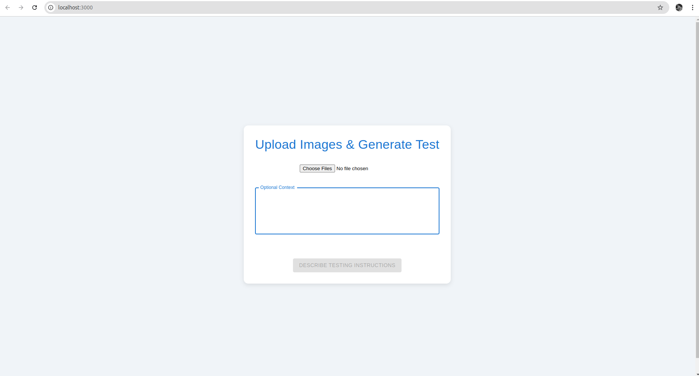
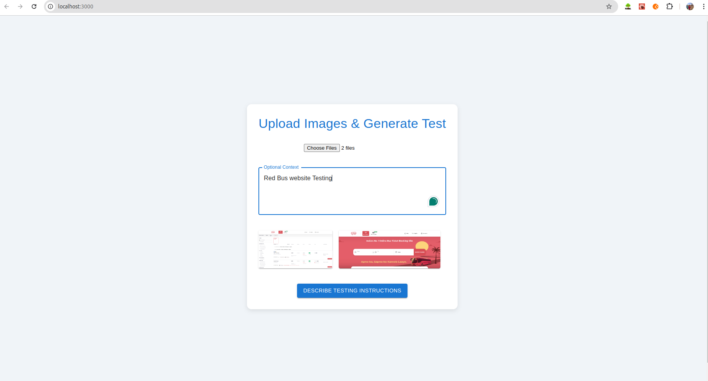
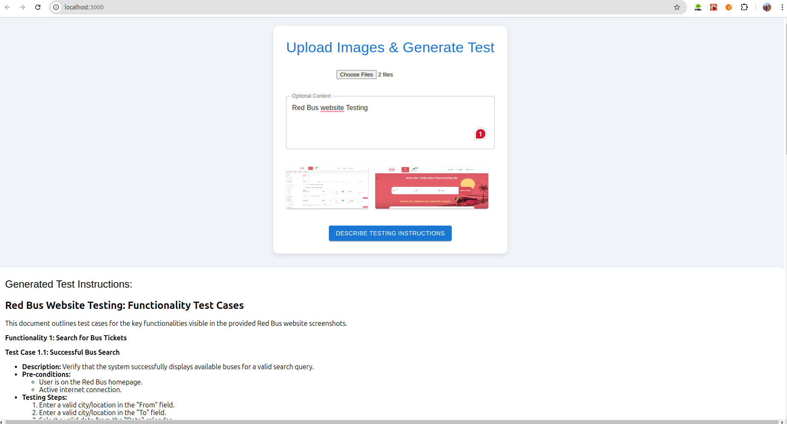
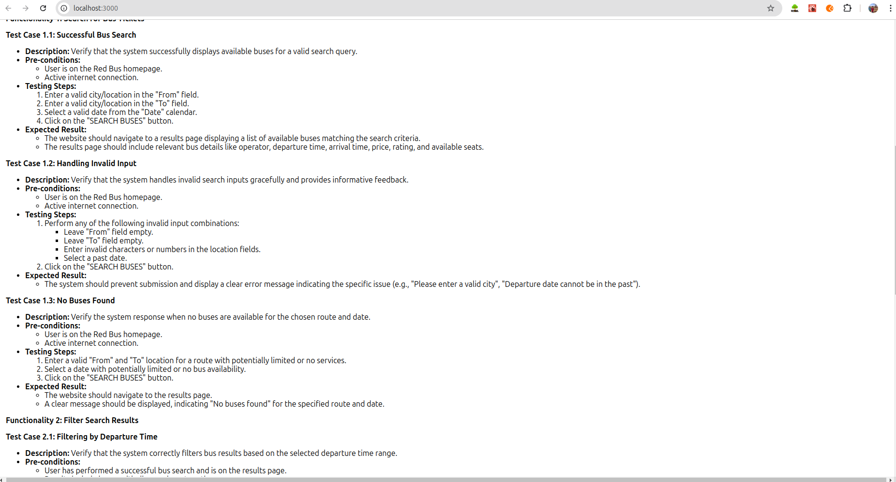

# Image Upload and Test Instruction Generation App

This web application allows users to upload multiple images and, optionally, provide context to generate detailed testing instructions using Google Generative AI. The front-end is built using React and Material-UI, while the back-end is powered by FastAPI and integrates Google's Gemini 1.5 Pro model to generate step-by-step test guides based on the uploaded images.

## Features

- Upload multiple images and optional context to generate test instructions.
- Images are previewed on the front-end.
- Step-by-step testing instructions generated using Google Generative AI based on the provided screenshots.
- Instructions include descriptions, pre-conditions, testing steps, and expected results.
- Cross-Origin Resource Sharing (CORS) enabled to allow requests from any domain.

## Tech Stack

### Frontend:
- **React**: For building the user interface.
- **Material-UI**: For UI components and styling.
- **Axios**: For making HTTP requests to the back-end.
- **React Markdown**: To render markdown content in the generated instructions.

### Backend:
- **FastAPI**: For creating the API endpoints and handling image uploads.
- **Google Generative AI (Gemini-1.5-pro)**: Used to generate testing instructions.
- **PIL (Python Imaging Library)**: To handle and process images.
- **CORS Middleware**: To handle cross-origin requests.

## Setup Instructions

### Prerequisites

- Node.js and npm installed on your machine.
- Python 3.9+ installed.
- Google Generative AI API key.

### Frontend Setup

1. **Install dependencies:**
   Navigate to the `frontend` directory and run:
   ```bash
   cd frontend
   npm install
   ```

2. **Start the frontend server:**
   After installation, run:
   ```bash
   npm start
   ```
   The frontend will run at `http://localhost:3000`.

### Backend Setup

1. **Install Python dependencies:**
   Navigate to the backend directory and create a virtual environment:
   ```bash
   python3 -m venv venv
   source venv/bin/activate
   pip install fastapi pillow google-generative-ai
   ```

2. **Set up environment variables:**
   Replace the API key placeholder in the `main.py` file with your Google Generative AI API key:
   ```python
   genai.configure(api_key="YOUR_GOOGLE_GENERATIVE_AI_API_KEY")
   ```

3. **Start the backend server:**
   Run the FastAPI server:
   ```bash
   uvicorn main:app --reload
   ```
   The backend will run at `http://127.0.0.1:8000`.

### Usage

1. Open the frontend app at `http://localhost:3000`.
2. Select images and (optionally) provide context in the text field.
3. Click on "Describe Testing Instructions" to upload the images and generate the instructions.
4. The backend will return a detailed, step-by-step guide on how to test the functionalities shown in the screenshots.

### API Endpoints

- **POST /upload_images/**: Endpoint to upload images and generate test instructions.
  - **Request**: 
    - `files[]`: List of images.
    - `context`: Optional textual context.
  - **Response**: JSON object with generated instructions and a list of deleted image files.

### Example Response
```json
{
  "Generated Instructions": "## Test Cases for RedBus Website\n\n**Test Case 1: Search for...",
  "Deleted Files": [
    "uploaded_images/image1.png",
    "uploaded_images/image2.png"
  ]
}
```

### Frontend File Structure

```bash
frontend/
├── public/
├── src/
│   ├── components/
│   ├── App.js       # Main application file
│   ├── App.css      # Styling for the app
│   ├── index.js     # Entry point
├── package.json     # Project dependencies
└── README.md        # Project documentation
```

### Backend File Structure

```bash
backend/
├── main.py          # FastAPI app with image handling and content generation
├── uploaded_images/ # Directory to temporarily store images
```

## How it Works

- Users upload images and optional context via the frontend.
- The images and context are sent to the FastAPI back-end where they are processed.
- The backend uses the Google Generative AI model to generate comprehensive testing instructions based on the screenshots.
- The instructions are sent back to the frontend and displayed to the user.

## Results Screenshot

1. **Initial Web Interface:**
   

2. **Putting Context and Uploading Image:**
   

3. **Result Screenshot:**
   
   

## License

This project is licensed under the MIT License.

---
